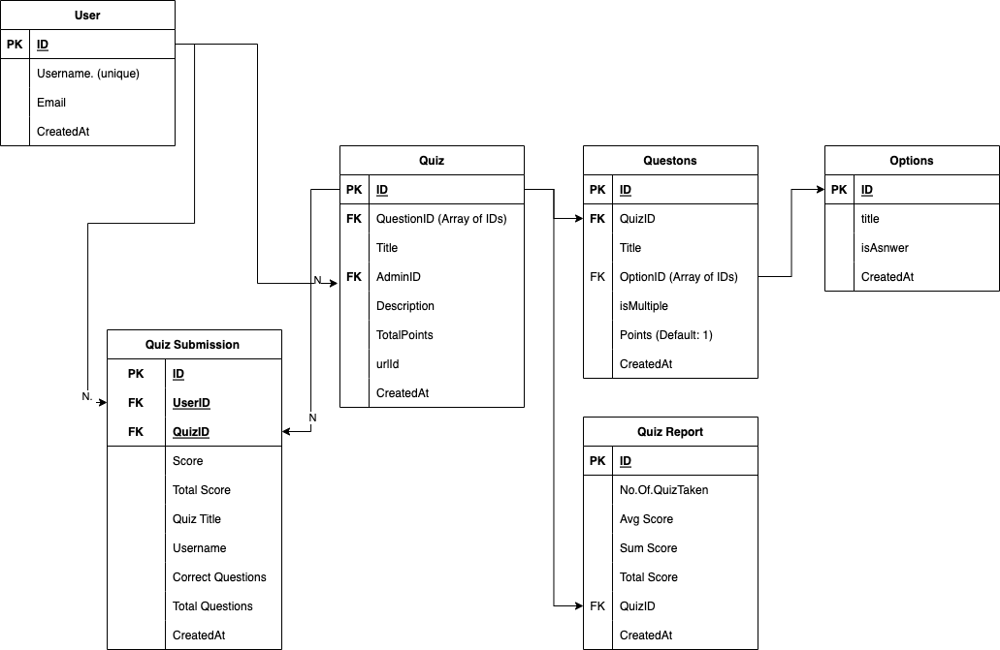

# API

This folder contains code for the APIs for the Quiz App.

## Models:

There are 4 database models created for the current implementation.

-   User
-   Quiz
-   Quiz Report
-   Quiz Submission

Note: Question and Option are present inside Quiz.



#### NOTE:

For getting started with the project please look into **[`CONTRIBUTING.md`](../../CONTRIBUTING.md)**.

## API routes

The following are the API routes exposed by the server.

-   **`/quiz`**

    -   `GET`: Get All Quizzed
    -   `POST`: Create Quiz

-   **`/quiz/:id`**

    -   `GET`: Get Quiz By ID
    -   `PUT`: Update Quiz

-   **`/quiz/submit`**

    -   `POST`: Submit Quiz

-   **`/quiz/report`**

    -   `GET`: Get all quiz reports

-   **`/quiz/report/:id`**

    -   `GET`: Ger quiz report by Quiz ID

-   **`/submit`**

    -   `GET`: Get all submissions

-   **`/submit/:id`**

    -   `GET`: Get submission by ID

-   **`/submit/quiz/:id`**

    -   `GET`: Get submission by Quiz ID

-   **`/submit/user/:id`**

    -   `GET`: Get submission by User ID

-   **`/docs`**

    -   `GET`: Get Swagger API documentation

-   **`/docs.json`**

    -   `GET`: Get `OpenAPI` collection configuration in `json` format

### Environment Variables

Create `.env` file inside the directory and add the following environment variables.

```.env
MONGO_URL=<DATABASE_URL>
PORT=<SERVER_PORT>
```
